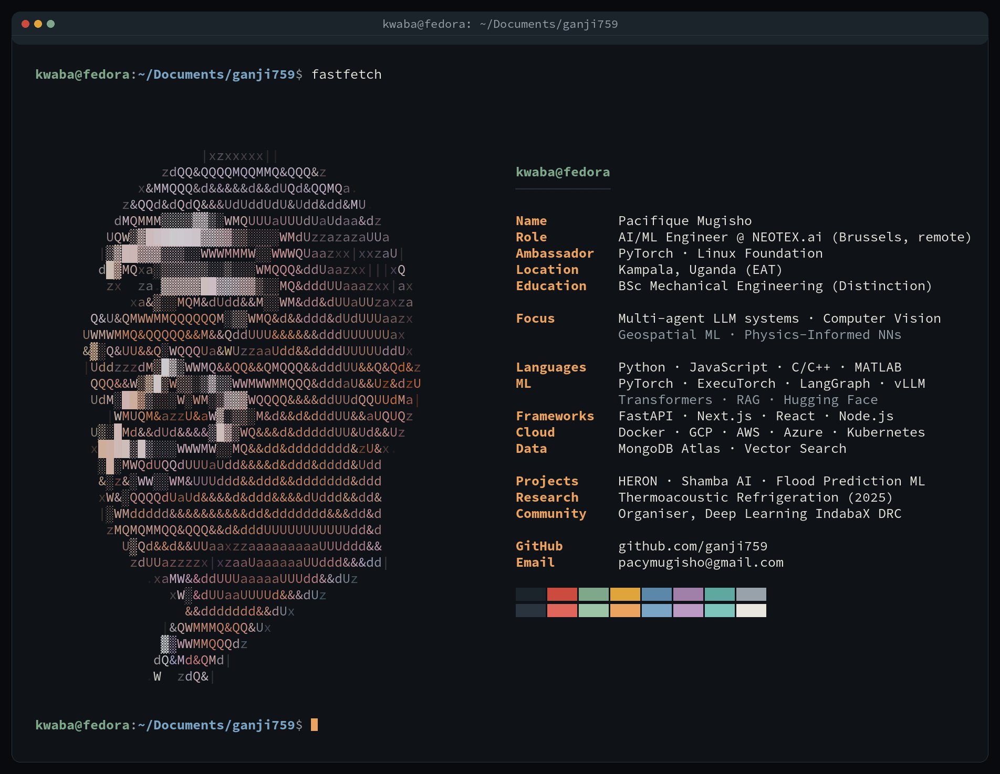

### Building production AI systems from an engineering-first mindset

---

- 💼 **At NEOTEX.ai:** shipping OpenAI/Gemini-powered features to production — from optimizing serving latency for the Halisi Livestock mobile app to building diffusion-based synthetic-data and vision-language pipelines.
- 🔬 **Published research:** *Development of a Thermoacoustically-Driven Thermoacoustic Refrigerator* (2025, peer-reviewed): 70% Carnot efficiency with zero-GWP working gases, validated through computational modeling.
- 🌍 **Community:** Organiser of **Deep Learning IndabaX DRC**, growing the AI ecosystem across Central & East Africa, and contributing to the PyTorch/ExecuTorch open-source ecosystem.
- 🧠 **Currently exploring:** agentic architectures, on-device inference with ExecuTorch, and satellite-imagery ML for climate resilience.

---

### 🚀 Featured Projects

| Project | What it does | Stack |
|---|---|---|
| **[HERON: job-ai-screener](https://github.com/ganji759/job-ai-screener)** | *Hiring Evaluation & Ranking for Optimized Networks.* AI hiring platform screening 500+ resumes/minute across 5 weighted dimensions; cut hiring from 2 weeks to 1 day. [Live demo](https://ai-hr-pi.vercel.app/) | Next.js · Fastify · Gemini · MongoDB Atlas · Redis/BullMQ · MCP |
| **[Shamba AI: Smartagro](https://github.com/ganji759/Smartagro)** | Multilingual agricultural advisory for East African smallholders: photograph a sick crop, get instant diagnosis + local-language advice. | Gemini · Vertex AI · Cloud Vision · Firebase |
| **[Flood Prediction from Satellite Imagery](https://github.com/ganji759/Flood-Prediction-Using-Machine-Learning)** | Segmentation ensemble (ResNet, DenseNet, ViT) on Sentinel-1/2 imagery for Kinshasa; 95%+ flood-detection accuracy. Built for an IndabaX DRC workshop. | PyTorch · AWS S3 · QGIS · Sentinel |
| **[PINNs Workshop with PyTorch](https://github.com/ganji759/Worshop-on-PINNs-with-PyTorch)** | Hands-on workshop building a Physics-Informed Neural Network from scratch: autograd-based ODE residuals and physics + data loss balancing. | PyTorch · autograd · NumPy |

---

### 🤝 Let's connect

